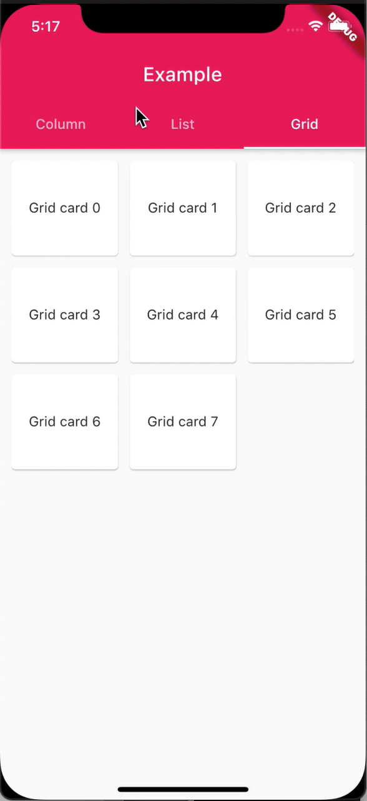

# Stagger

Minimal library to easily create staggered animations for lists of items in Flutter.



## Getting Started

You only need to pass in the count and builder function to get started. Then use the animations to drive whatever animation you'd like to run.

```dart
class ExampleHome extends StatelessWidget {
  @override
  Widget build(BuildContext context) {
    return Scaffold(
      appBar: AppBar(title: Text("Home")),
      body: Stagger(
	count: 4,
	builder: (context, animations) => Column(
	  children: [
	    FadeTransition(opacity: animations[0], child: SomeCard(i: 1)),
	    FadeTransition(opacity: animations[1], child: SomeCard(i: 2)),
	    FadeTransition(opacity: animations[2], child: SomeCard(i: 3)),
	    FadeTransition(opacity: animations[3], child: SomeCard(i: 4)),
	  ],
	),
      )
    ); 
  }
}

class SomeCard extends StatelessWidget {
  final int i;

  ExampleHome({this.i});

  @override
  Widget build(BuildContext context) {
    return Card(
      child: Container(
	height: 50,
	child: Text("Item $i")
      );
    );
  }
}
```
